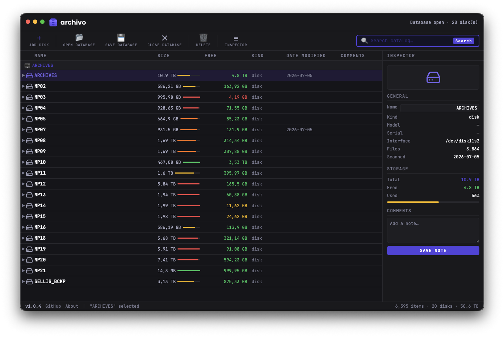
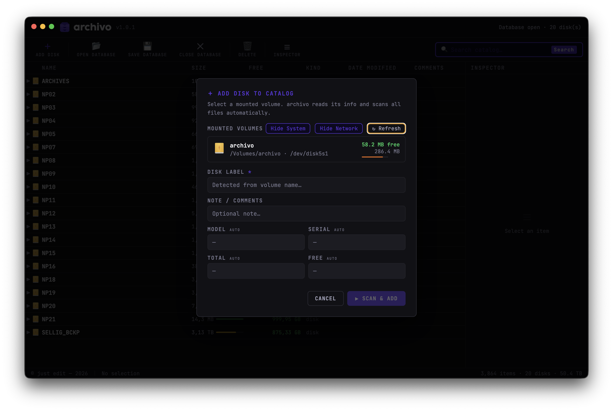

# archivo

**Catalogue your archive drives once, search them all offline.**

archivo scans a hard drive into a single browsable index, so you can find any
file in seconds even when the drive is sitting on a shelf, unplugged. It is a
desktop app built for video editors and anyone juggling a wall of external
archive disks.

Built with Electron. Runs on macOS and Windows.

---

## Screenshots

The file-tree browser: catalogued disks, folders and files with size, kind and
date columns, an inspector panel on the right, and a path bar showing where the
selected file lives.



Adding a disk: archivo lists your mounted volumes, flags the ones already in
the catalog, and scans the selected drive with live progress.



---

## Features

- Scan any mounted volume into a fast, browsable file index
- Full offline search across every catalogued disk
- File-tree browser with name, size, kind, date and free-space columns
- Volume-type icons for USB, network and system drives
- Duplicate detection: update an existing disk or add a separate entry
- Right-click a catalogued disk to re-scan and update it from the live drive
- Live scan progress with percentage and estimated time, cancellable
- Path bar showing the disk and full location of any selected file
- Compressed catalog files (`.archivo`), up to ~90% smaller than raw JSON
- Document-based: New / Open / Save / Save As, with an edited marker in the
  title bar and a prompt before anything would discard unsaved changes
- Double-click a `.archivo` file in Finder or Explorer to open it, or drop it
  anywhere on the window
- Open Recent, in the File menu and on the welcome screen
- Full application menu with the usual keyboard shortcuts
- Atomic saves: an interrupted save can never truncate the catalog on disk
- Optional update check against a version file hosted in this repo

## Install (from a release)

Grab the latest build from the
[Releases page](https://github.com/noar-justedit/archivo/releases):

- **macOS**: download the `.dmg`, open it, drag archivo to Applications.
- **Windows**: download the installer (`archivo Setup x.y.z.exe`) or the
  portable `.exe`.

## Build from source

Requires [Node.js](https://nodejs.org) (LTS).

```bash
git clone https://github.com/noar-justedit/archivo.git
cd archivo
npm install
npm start          # run in dev
npm test           # headless smoke test of the document model
```

On Linux/CI the test needs a display: `xvfb-run -a npm test`.

### Packaging

`.command` files can be run from a terminal (`./build-mac.command`) or simply
double-clicked in Finder — they open a Terminal window, run the build, and
wait for a keypress before closing so you can read the output.

If you downloaded the sources as a ZIP (or the files were uploaded through the
GitHub web interface, which drops the executable bit), make the scripts
runnable once:

```bash
chmod +x build*.sh build*.command
```

```bash
# macOS (Apple Silicon) — DMG + zip
./build-mac.command

# Windows installer + portable, from a Windows machine
./build-win.bat        # or: npm run build:win

# Windows build cross-compiled from macOS (uses Wine)
./build-win-from-mac.command
```

Building the Windows target from macOS requires Homebrew and Wine; the
`build-win-from-mac.command` script checks for them and guides the install.
The NSIS installer cross-builds cleanly; the *portable* `.exe` additionally
needs 32-bit support in Wine, so if that step fails, build on a real Windows
machine with `build-win.bat` — the installer is unaffected.

## Project structure

```
archivo/
├── src/
│   ├── main.js        Electron main process (window, menu, document state,
│   │                  IPC, volume scan, update check)
│   ├── preload.js     Context-isolated bridge (window.archivo API)
│   ├── index.html     Renderer: full UI, styles and app logic
│   ├── assets/        App icon
│   └── fonts/         Poppins (OFL)
├── test/smoke.js      Headless test of the document model (npm test)
├── build/             Packaging icons (icon.icns, icon.ico)
├── build-mac.command   macOS build (double-click in Finder)
├── build-win.bat      Windows build (on Windows)
├── build-win-from-mac.command  Windows build from macOS via Wine
├── version.json       Update manifest read by the app
└── package.json       electron-builder config
```

## Update manifest

The app checks `version.json` in this repo on launch. To publish an update,
bump the version there after cutting a release:

```json
{ "archivo": { "version": "1.0.2", "url": "https://github.com/noar-justedit/archivo/releases" } }
```

The check fails silently offline and never blocks startup. A newer version
shows a dismissible notice; a dismissed version is not shown again.

## Keyboard shortcuts

| | macOS | Windows |
|---|---|---|
| New catalog | ⌘N | Ctrl+N |
| Open catalog | ⌘O | Ctrl+O |
| Save | ⌘S | Ctrl+S |
| Save As | ⇧⌘S | Ctrl+Shift+S |
| Add disk | ⌘D | Ctrl+D |
| Export | ⌘E | Ctrl+E |
| Find | ⌘F | Ctrl+F |
| Toggle inspector | ⌘I | Ctrl+I |
| Close catalog | ⇧⌘W | Ctrl+Shift+W |

## Data format

A catalog is JSON: a list of disks, each with metadata and a nested file
tree. Saved catalogs are gzip-compressed with an `.archivo` extension; plain
`.json` catalogs are read, and written uncompressed if you pick the JSON
filter in Save As. Saves go through a temp file in the same folder and are
renamed into place, so an interrupted save leaves the previous file intact. Everything stays local, there is no account
and no telemetry.

## License

archivo is free software, released under the
[GNU General Public License v3.0](LICENSE).

Fonts: [Poppins](https://github.com/itfoundry/Poppins) under the SIL Open Font
License (see `src/fonts/OFL-Poppins.txt`). The application icon is the author's
own work.
